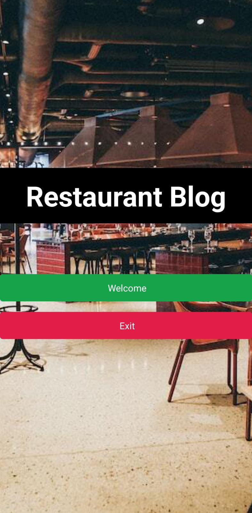
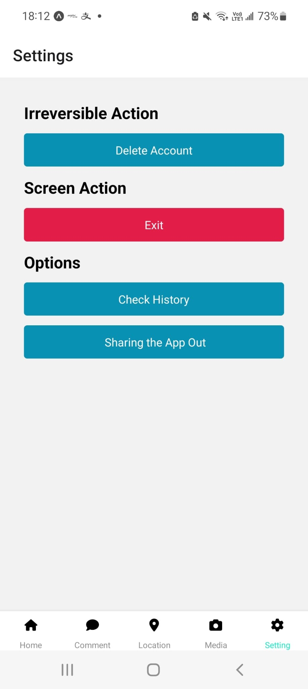

# myexporeactnative

# Capture
|  |
|

## Reminder

### Please install nodejs(https://nodejs.org/zh-tw/download/) in your computer.

## Steps to start uop the application
### npm install -g expo-cli
### npm install --force
### npm audit fix --force
### npm start
